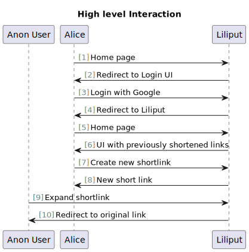
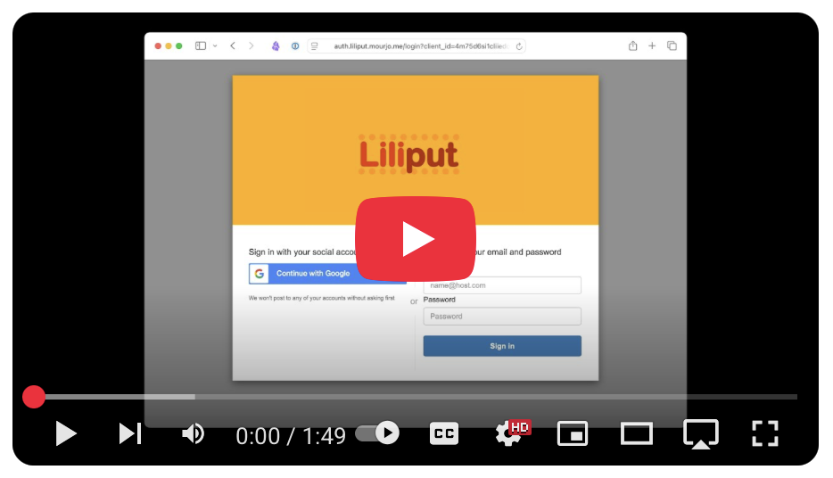
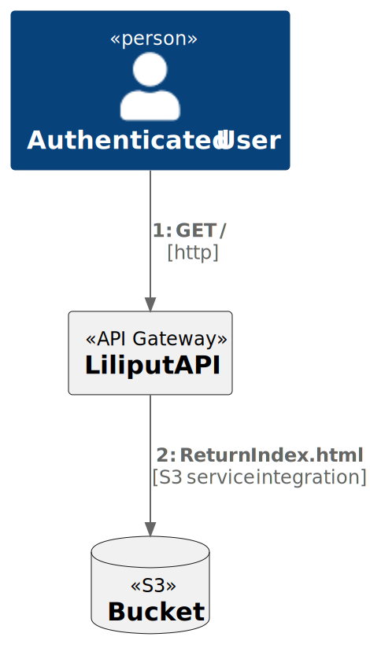
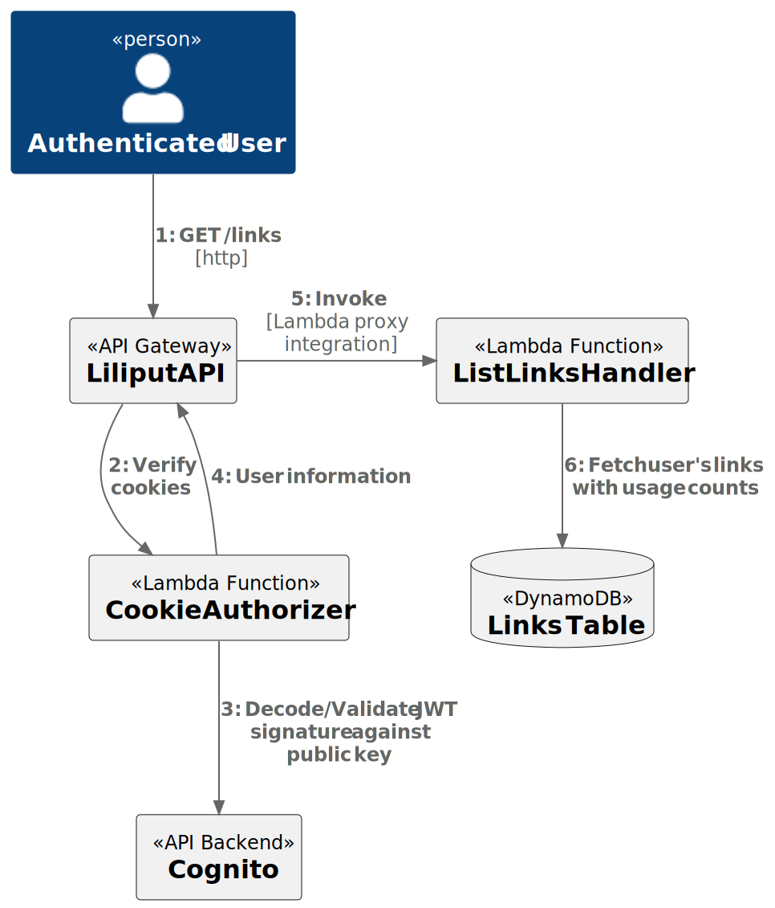
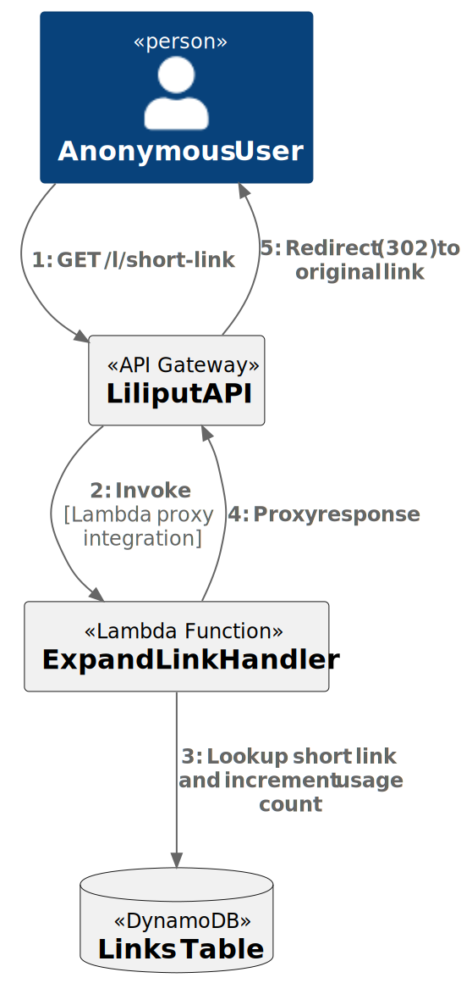
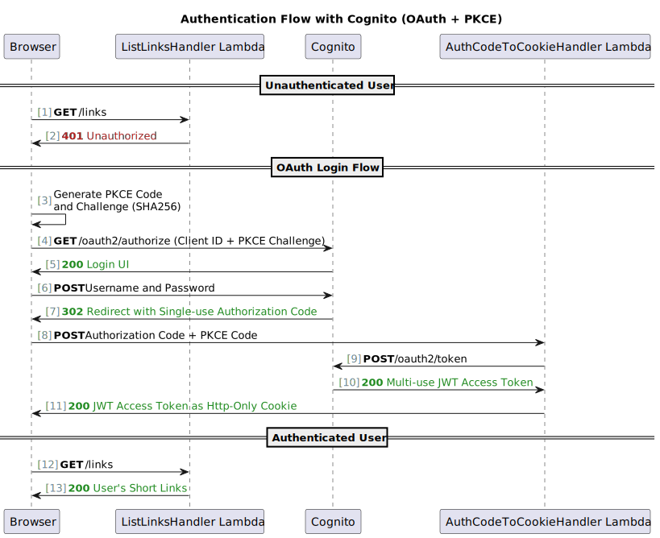
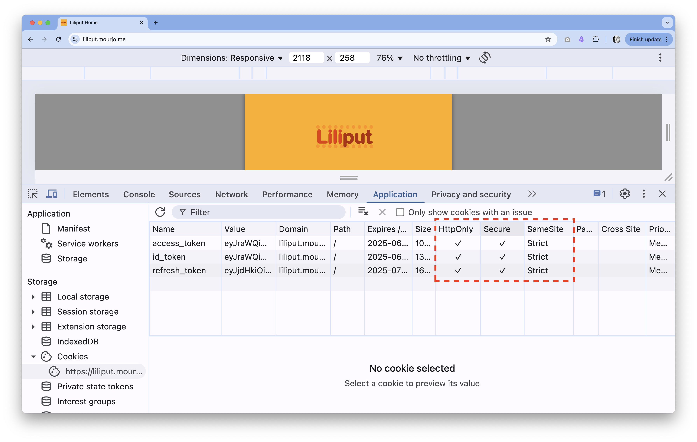

# Liliput: Secure Serverless Shortlinks on AWS

This is a project that shortens links, built on AWS. This is deployed here:
https://liliput.mourjo.me

## Goal

- Authenticated users can create new short links
- Short links can be visited without signing in
- Rudimentary statistics viewable by the creator - number of visits
- Limited number of expansions

## Why this is secure?

- To create short links, you need a valid Google account
- Signing in to Google uses the Oauth 2.0 (using [PKCE](https://auth0.com/docs/get-started/authentication-and-authorization-flow/authorization-code-flow-with-pkce))
- All [session cookies are HTTP-only](images/cookies.png) (so no script can access it)
- Links can only be expanded 25 times to prevent misuse, unless the user is verified

# Demo

https://liliput.mourjo.me

# Implementation

Following are the major implementation pieces - all built on AWS and deployed
here: https://liliput.mourjo.me

## Serving the static HTML with S3

- A single HTML page is served from S3 which then makes XHR requests for getting the current user's
  links and creating new short links

## Homepage: Showing list of previously created links

- The current user is inferred from the lambda function `CookieAuthorizer` which reads the cookie
  header and identifies the user
- A lambda function `ListLinksHandler` serves the current user's links from DynamoDB
- Creation of a new short link is similar to this flow, except a link is inserted into DynamoDB
  instead of reading from it.

## Visiting a short link

- By default, a link can be expanded 25 times - to prevent spam usage, but verified users have unlimited access
- Anonymous users can visit existing shortlinks
- A Lambda function fetches the original link from DynamoDB and redirects the user to it

## Authentication flow with AWS Cognito

- [Cognito hosted UI](https://docs.aws.amazon.com/cognito/latest/developerguide/cognito-user-pools-app-integration.html)
  is used for social login
- [PKCE OAuth authorization flow](https://docs.aws.amazon.com/cognito/latest/developerguide/using-pkce-in-authorization-code.html)
  is used to make authorization code flow a bit more secure
- [Hardened (http-only) cookies](https://www.freecodecamp.org/news/web-security-hardening-http-cookies-be8d8d8016e1/)
  are used to enhance security

All cookies are HTTP-only and secure:

## Custom domain

- AWS cognito
  supports [custom domains](https://docs.aws.amazon.com/cognito/latest/developerguide/cognito-user-pools-add-custom-domain.html),
  in this project Cognito is configured with `auth.liliput.mourjo.me`
- REST APIs in `API gateway`
  supports [custom domains](https://docs.aws.amazon.com/apigateway/latest/developerguide/how-to-custom-domains.html), `liliput.mourjo.me`
  is used in this case

# Social Login with Google

- Cognito user pools can be configured to work
  with [identity providers like Google](https://docs.aws.amazon.com/cognito/latest/developerguide/cognito-user-pools-identity-federation.html)
- In this project we are using the OAuth2
  flow [supported by Google](https://developers.google.com/identity/protocols/oauth2)

# Limitations

- Lambda functions using Java are slow, even
  with [Snapstart](https://docs.aws.amazon.com/lambda/latest/dg/snapstart.html).
  Since each API request is served by a different Lambda, the UI can feel quite slow.
  Possible alternatives are: reserved concurrency(which is costly) or a different runtime.
