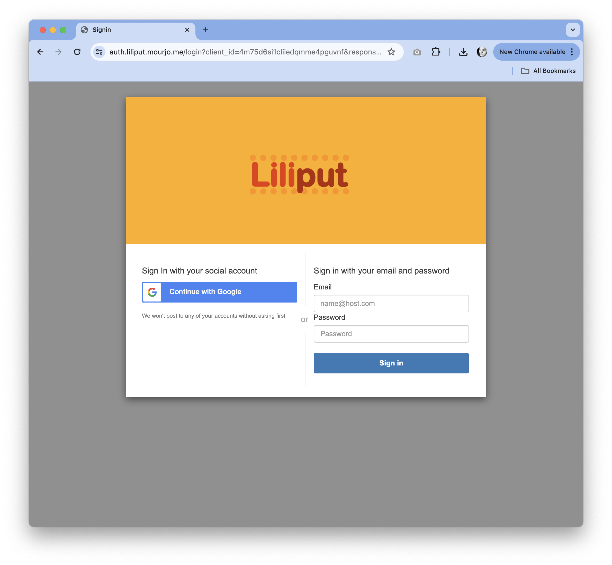
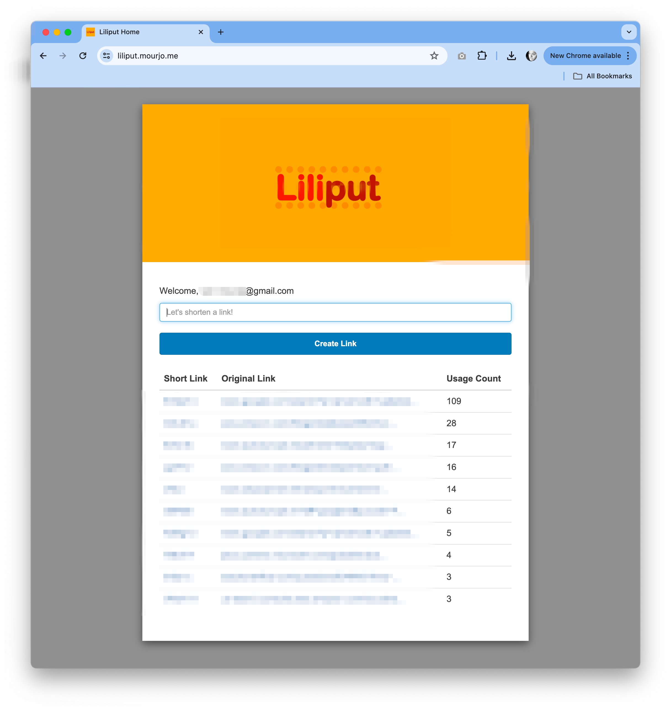
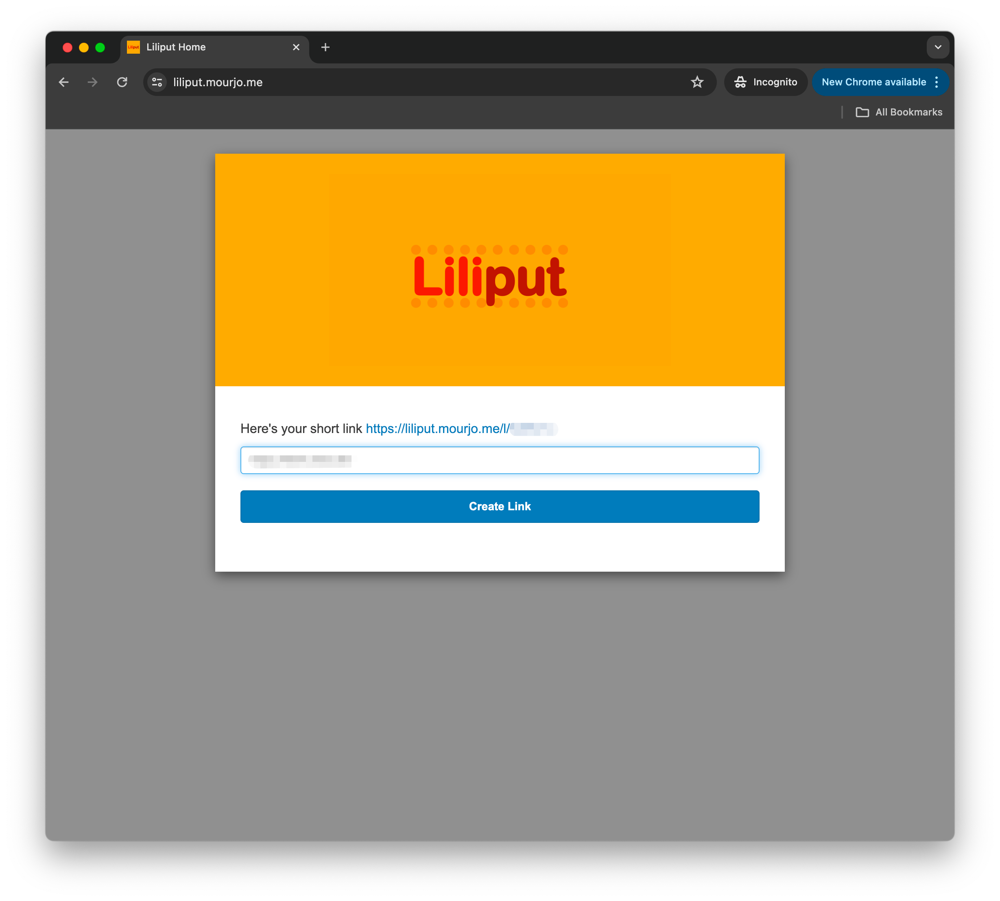
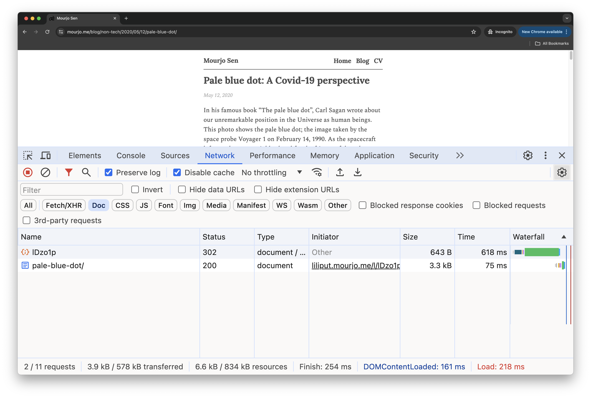
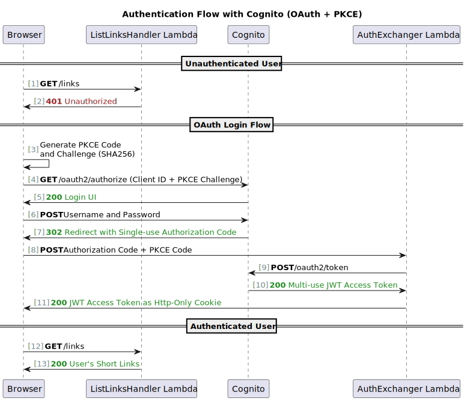

# Liliput: Serverless shortlinks on AWS
This is a project that shortens links on a per-user basis and collects rudimentary usage statistics.

## Live Deployment
This is deployed here
https://liliput.mourjo.me

### Screenshots
<table>

<tr>
    <td>Login</td>
    <td>Home</td>
    <td>Short Link Creation</td>
    <td>Expand Link</td>
</tr>
<tr>
    <td></td>
    <td></td>
    <td></td>
    <td></td>
</tr>

</table>

# Implementation
## Authentication Flow
A simplified version of the login flow is shown below. Details here:
- [Cognito hosted UI](https://docs.aws.amazon.com/cognito/latest/developerguide/cognito-user-pools-app-integration.html) 
- [PKCE OAuth authorization flow](https://docs.aws.amazon.com/cognito/latest/developerguide/using-pkce-in-authorization-code.html)
- [Hardened (http-only) cookies](https://www.freecodecamp.org/news/web-security-hardening-http-cookies-be8d8d8016e1/)

